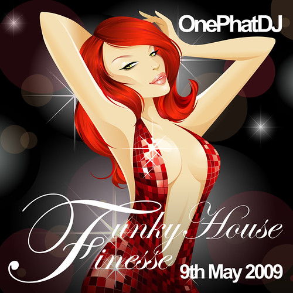

The debut _Funky House Finesse_ show broadcast on [Lifted Radio](https://lifted-radio.co.uk/) from **4pm** for 2 hours of the finest, freshest and funkiest house tracks around. Featuring the likes of **Degrees of Motion**, **Warren Clarke**, **Ralf GUM**, **eSQUIRE**, **Sandy Rivera**, **Roger Sanchez**, **Dirty Vegas**, **Dennis Christopher**, **The Young Punx** and **Pulse**, you will be hard pushed to find a more uplifting mix of tunes. Make sure you let us know where you're listening, upload some photos, share it with your friends, even get them round for a bit of a dance. It's the perfect warmup to your Saturday night out!

## 

## Download

[Funky House Finesse 3 (9th May 2009)](/download/1) (high quality 192kbps MP3, 165.1MB)

## Track Listing

1. Pulse ft Antoniette Robertson - The Lover That You Are (Kenny Hayes Sunshine Funk Mix) \[AATW\]
    
    > AATW's very own Kenny Hayes lays an anthemic piano bed to the huge 1996 classic to kick off the show. Already gaining support from Hed Kandi's David Dunne, be sure to keep your ears to the ground for this release.
    
2. [Groove Invaderz ft Katy Allen - Lead You To Love (Jay Vegas Soulful) \[Playmore\]](https://www.traxsource.com/index.php?act=show&fc=tpage&cr=titles&cv=31803 "Buy this track from Traxsource for $1.99")
    
    > Released 28th March 2009, featuring lead vocals from Katy Allen, backing vocals from Tara McDonald, produced by Jay "Vegas" Forrester & Daryl Hughes, guitar played by Andy Lee aka Central Avenue
    
3. [Logical Groove ft Diana Waite - Pieces (Groove Delivers Vocal Mix) \[Gotta Keep Faith\]](https://www.traxsource.com/index.php?act=show&fc=tpage&cr=titles&cv=31900 "Buy this track from Traxsource for $1.99")
    
    > Released on Italy's Gotta Keep Faith label on 20th April 2009, this delectable tune oozes charisma and Summer, just in time for WMC09. This remix is by East European producer Groove Delivers
    
4. [Ralf GUM ft Daniel Thomas - Higher High (Ralf GUM Original Disco Attack Mix) \[Gogo\]](https://www.traxsource.com/index.php?act=show&fc=tpage&cr=titles&cv=31374 "Buy this track from Traxsource for $1.99")
    
    > Lead vocals by UK's Daniel Thomas, choir director of The London Community Gospel Choir for 5 years, rose to fame with Brandon "Blockster" Block in 1999 with "_Grooveline_", released on 30th March 2009.
    
5. [Degrees of Motion ft Billy Porter -  Show Me (RJ Original Vocal) \[Phase Deux Musiq\]](https://www.traxsource.com/index.php?act=show&fc=tpage&cr=titles&cv=28788 "Buy this track from Traxsource for $1.99")
    
    > Selected by Mark Doyle and featured on Fierce Disco 3 compilation, re-work of the Glenn Jones 1984 soul classic "Show Me", produced by the legendary Eric Kupper & Richie Jones with numerous classics under their belts, released on 5th February 2009.
    
6. [Sandy Rivera ft LT Brown - Come Into My Room (Take It Back Mix) \[Defected\]](https://www.djdownload.com/mp3-detail/Sandy+Rivera+ft+LT+Brown/Come+Into+My+Room/ITH/659465 "Buy this track from DJ Download for £1.25")
    
    > Featured on the new collaborative, digital-only, budget-priced compilation "For The Love Of House Vol 1" from Defected, Strictly Rhythm & Subliminal. Originally released 11yrs ago on Defected.
    
7. [Warren Clarke & Tara McDonald - Love Crazy  (Triple D Remix) \[Hed Kandi\]](https://www.play.com/Music/MP3-Download-Track/4-/9724366/Love-Crazy/Product.html?aid=9723391 "Buy this track from Play for 70p")
    
    > Available on Hed Kandi's The Mix (Spring 2009), [originally released on Stereo Sushi version 13](https://onephatdj.trackitdown.net/artist/179995/warren-clarke-and-tara-mcdonald.html) in August 2008 as a more soulful version and featured on Hed Kandi US 2009, strangely little support in the UK.
    
8. [Warren Clarke pres Jonni Black vs Shena - Bitch Is Back (Soul Junkie Remix) \[Hed Kandi\]](https://www.play.com/Music/MP3-Download-Track/4-/9724421/Bitch-Is-Back/Product.html?aid=9723391 "Buy this track from Play for 70p")
    
    > Second track featured on The Mix (Spring 2009), another huge remix of Hed Kandi favourite Warren Clarke from June 2008.
    
9. [Jenny Jones - Don't Walk Away (Shave Remix) \[Hard 2 Beat\]](https://onephatdj.trackitdown.net/genre/house/track/969778.html "Buy this track from Trackitdown for £1.49")
    
    > Covering the 1992 RnB hit by girl group Jade, Jenny Jones version originally gained traction in the underground bassline scene of Birmingham and Leeds before Ministry's Hard2Beat label snapped it up in January 2009.
    
10. [Francesco Diaz ft Karl Frierson - Say A Little Prayer (Raul Rincon Peaktime Remix) \[Wormland Gold\]](https://www.traxsource.com/index.php?act=show&fc=tpage&cr=titles&cv=31100 "Buy this track from Traxsource for $3.99")
    
    > Originally released in March 2005 and recently re-released with a huge array of remixes, massive uplifting cover of Dione Warwick's 1967 classic written by Burt Bacharach and Hal David. Be sure to check out the amazing Unplugged version to experience Karl Fierson's powerful vocals in all its glory.
    
11. [Roger Sanchez ft GTO - Turn On The Music (Ortega & Gold Remix) \[Egoiste\]](https://onephatdj.trackitdown.net/genre/house/track/899665.html "Buy this track from Trackitdown for £1.49")
    
    > Originally released in 2006 on Stealth Records, re-released on 12th March 2009. Monster tune seeing heavyweight remixers Chris Ortega and Thomas Gold take on the Chicago producer Roger Sanchez.
    
12. [Phil England pres Sunstitute ft Larissa - Open Up (Retribute) (Phil England Coastline Remix) \[Boomboxx Records\]](https://www.beatport.com/en-US/html/content/release/detail/161859/open_up_retribute "Buy this track from Beatport")
    
    > Phil England - whose already worked with Dan McKire and Max'C - teams up with Craig Dalzell to create this uplifting Ibiza-based funky house track. Vocals supplied by Larisa (one of the few girls signed to MoS).
    
13. eSQUIRE vs Bob Sinclair - Can You Feel It (Original Mix) \[White Label\]
    
    > Cheeky bootleg of the 1999 house classic by Bob Sinclair (an all-time favourite of One Phat DJ), eSQUIRE applying his trademark sound to create a bouncy, uplifting, (almost) electro track for the clubs.
    
14. [Dirty Vegas - Changes (eSQUIRE Remix) \[Toolroom Knights\]](https://www.toolroomrecords.co.uk/shop/digital/changes "Buy this track from Toolroom Records for £1.50")
    
    > British house trio Ben and Paul Harris with Steve Smith on vocals returned after a four year split to record new material, promoting their new stuff at WMC09 and Barack Obama's inauguration.
    
15. [Dennis Christopher - Set It Off  (Ian Carey Remix) \[Spinnin\]](https://www.traxsource.com/index.php?act=show&fc=tpage&cr=titles&cv=30733 "Buy this track from Traxsource for $1.99")
    
    > Potentially the biggest track of the year. Huge support from the likes of Hed Kandi's David Dunne, Ian Carey takes us back to the 90s with this acid-inspired remix, massive vocals, heavy piano loops.
    
16. [Dimitri from Paris pres Electra 80 - Rock This Town (Original Mix) \[Ssoh Music\]](https://onephatdj.trackitdown.net/genre/house/track/957430.html "Buy this track from Xpress Beats for 85p")
    
    > Something a little different now, delving in to the world of nu disco with the legend that is Turkish-born French DJ Dimitri from Paris. This track consists of so many samples, you'll struggle to identify them all.
    
17. [The Young Punx -  Never Die (12" Mix) \[Mofohifi Records\]](https://onephatdj.trackitdown.net/genre/techno/track/703097.html "Buy this track from Trackitdown for £1.49")
    
    > Originally released in September 2008, this disco-infused track made a recent comeback featurd on [Hed Kandi's Nu Disco](https://www.amazon.co.uk/Hed-Kandi-Disco-Various-Artists/dp/B001U7FWPA) compilation. Fronted by Hal Ritson, the Young Punx have delivered quite an eclectic selection of tunes over recent years - I've featured several of their productions in my podcast, all with different styles.
    
18. [Novy vs Eniac - Superstar (Show Me Your Intention) (Plastic Funk Remix) \[Ministry of Sound Germany\]](https://www.xpressbeats.com/release/superstar-show-me-your-intention-40752 "Buy this track from Xpress Beats for 85p")
    
    > Tom Novy puts his touch to DJ Jose's 1997 track "_Hesitate_" with a bunch of producers creating a diverse range of remixes in this new package. The Plastic Funk remix is by far my favourite but be sure to check out the Lissat & Voltax remix for something a bit tougher.
    
19. [Leonardo Carioti and Fedi T ft Vincent - Take Control (Xtended Vocal Mix) \[Smilax Italy\]](https://www.juno.co.uk/ppps/products/347490-01.htm "Buy this CD from Juno for £7.99")
    
    > The young Italian DJ has teamed up with fellow Italian Federico Trufelli bringing us a mixture of laid back piano loops fused with electro synths.
    
20. [Audioplayerz ft Sarah Brown - Crazy (Club Mix) \[Grooveland Records\]](https://onephatdj.trackitdown.net/genre/house/track/909403.html "Buy this track from Trackitdown for £1.49")
    
    > This is the debut track from Welsh trio Fabian Abeki, Emil Falek and Marcus Simpson, featuring the vocal talents of fellow Welsh singer Sarah Brown. Fabian met Sarah at an MTV Base gig in Bristol and immediately asked her to feature on their recent production. With support from BBC Radio 1 and Kiss FM, this is one to watch in 2009.
    
21. [Mack - Return Of The Mack 2009 (Spencer & Hill Remix) \[AATW\]](https://www.djtunes.com/track/return-of-the-mack-2009__327276 "Buy this track from DJ Tunes for 99p")
    
    > The German duo Peter Spencer and Josh Hill put their touch to the 1996 RnB hit by Mark Morrison in a collection of remixes for 2009.
